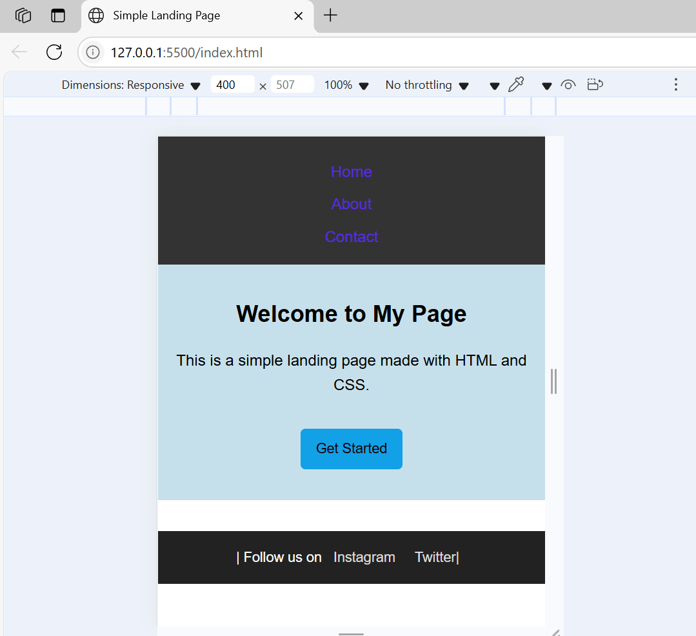

#  Simple Responsive Landing Page

This project was originally created as part of a previous task to build a basic desktop-only landing page using HTML and CSS. 

As part of this task, it has now been enhanced to be **mobile-friendly** using **CSS media queries**.

## What Was Added

- Responsive layout using `@media (max-width: 768px)`
- Header and navigation now stack vertically on small screens
- Font sizes and spacing adjusted for better readability
- Images scale properly within their containers
- Removed horizontal scrolling on mobile devices

### 💻 Mobile View

